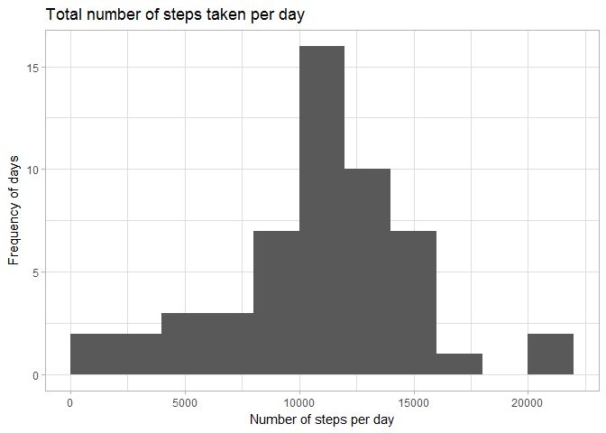
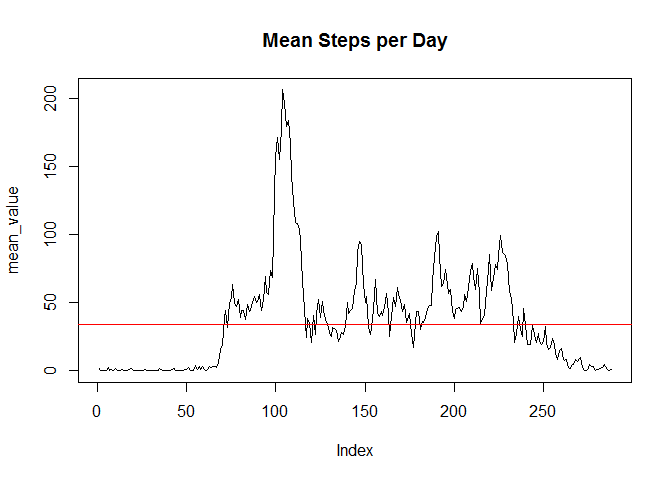
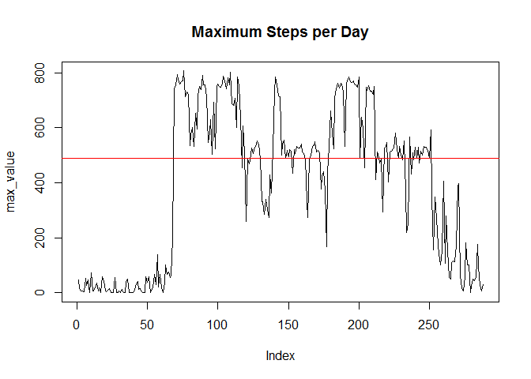
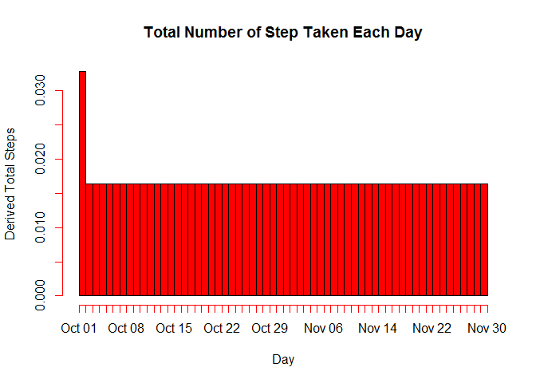
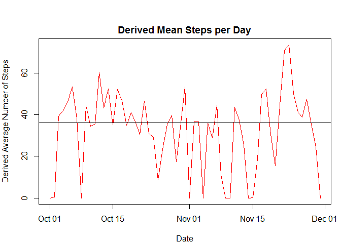
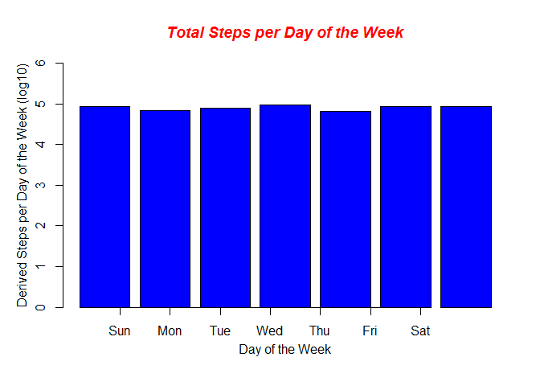

--- 
title: "Reproducible Research: Peer Assessment 1" 
output: 
  html_document: 
    keep_md: true 
---

```r
# library(R.utils)
library(dplyr)
library(xtable)
library(kableExtra)
library(ggplot2)
```

# Version THREE
## Loading and preprocessing the data. Task A-1.

```r
DF <- read.csv("activity.csv", header=T, sep=',', na.strings="NA", check.names=F, stringsAsFactors=F, comment.char="", quote='\"')
DF2 <- DF
DF2$Date <- as.Date(as.character(DF2$date,format="%Y-%m-%d"))
```

Data Description (rows, columns)


```r
dim(DF2) %>% kable("html") %>% kable_styling()
```

<table class="table" style="margin-left: auto; margin-right: auto;">
 <thead>
  <tr>
   <th style="text-align:right;"> x </th>
  </tr>
 </thead>
<tbody>
  <tr>
   <td style="text-align:right;"> 17568 </td>
  </tr>
  <tr>
   <td style="text-align:right;"> 4 </td>
  </tr>
</tbody>
</table>
Task A-2

### Task B-1
## What is mean total number of steps taken per day? 
Calculate total, mean, and median steps taken per days

```r
stepsDay <- DF2 %>% filter(!is.na(steps)) %>% group_by(date) %>% summarize(totalSteps=sum(steps)) 
meanStepsPerDay <-  round(mean(stepsDay$totalSteps),0)
medianStepsPerDay <- median(stepsDay$totalSteps)

TotalstepsDay <- sum(stepsDay$totalSteps)

cat(paste("Total number of activities taken ",TotalstepsDay  ))
```

```
## Total number of activities taken  570608
```

```r
cat ("\n")
```

```r
cat(paste("Mean steps taken per day ",meanStepsPerDay))
```

```
## Mean steps taken per day  10766
```

```r
cat ("\n")
```

```r
cat(paste("Median steps taken per day ",medianStepsPerDay))
```

```
## Median steps taken per day  10765
```

```r
cat ("\n")
```

```r
tot_steps <- DF2 %>% group_by(date) %>%
        summarise(no_steps = sum(steps)) %>%
        filter(!is.na(no_steps)) %>%
        arrange(date)
tot_steps$date <- as.Date(as.character(tot_steps$date,format="%Y-%m-%d"))


ggplot(tot_steps, aes(x = no_steps)) + 
  geom_histogram(breaks = seq(0, 22000, by = 2000) ) + 
  labs(x = "Number of steps per day", y = "Frequency of days") + 
  labs(title = "Total number of steps taken per day") +
  theme_light()
```

<!-- -->

## What is the average daily activity pattern?


The 'Not a Number"  values excluded from the calculations.


```r
mean(tot_steps$no_steps, na.rm = TRUE)
```

```
## [1] 10766.19
```

```r
median(tot_steps$no_steps, na.rm = TRUE)
```

```
## [1] 10765
```

```r
DFX <- DF %>% group_by(interval) %>% 
         arrange(interval) %>% 
         summarise(mean_value = mean(steps, na.rm = TRUE))


with (DFX, plot(mean_value, pch=20, type = "l"))
abline(h=median(DFX$mean_value), col="red")
title(main="Mean Steps per Day")
```

<!-- -->

```r
DFZ <- DF %>% group_by(interval) %>% 
         arrange(interval) %>% 
         summarise(max_value = max(steps, na.rm = TRUE))

with (DFZ, plot(max_value, pch=20, type = "l"))
abline(h=median (DFZ$max_value), col="red")
title(main="Maximum Steps per Day")
```

<!-- -->

## Imputing missing values
There are

```r
nrow(filter(DF, is.na(steps)))
```

```
## [1] 2304
```
Rows with missing values ....
This data set has

```r
rows_missing_steps <- is.na(DF$steps)
cat(paste("Missing rows of data is ",sum(rows_missing_steps)))
```

```
## Missing rows of data is  2304
```

The missing values will be replaced with the median number of steps.


```r
DF3 <- DF
DF3$date <- as.Date(as.character(DF3$date,format="%Y-%m-%d"))
rows_missing_steps <- is.na(DF$steps)
DF3$steps[rows_missing_steps] <- median(DF3$steps,na.rm = TRUE )


tot_steps3 <- aggregate(DF3$steps, by=list(date=DF3$date), FUN=sum)
names(tot_steps3)[2]<-paste("total_steps")
tot_steps3$date <- as.Date(as.character(tot_steps3$date,format="%Y-%m-%d"))
with (tot_steps3, hist(date, breaks = 61,  main="Total Number of Step Taken Each Day", ylab="Derived Total Steps", xlab="Day", col="red"))
```

<!-- -->
### Replacing the missing values does mpacts the mean and median total number of steps taken per day.


```r
mean_steps3 <- aggregate(DF3$steps, by=list(date=DF3$date), FUN=mean)
mean_steps3$date <- as.Date(as.character(mean_steps3$date,format="%Y-%m-%d"))
par(mfrow = c(1, 1), mar = c(4, 4, 2, 1), oma = c(0, 0, 2, 0))
with (mean_steps3, plot(date, x, xlab = "Date", ylab="Derived Average Number of Steps",main = "Derived Mean Steps per Day", type="l", col="red"))
abline(h=median(mean_steps3$x))
```

<!-- -->

The median (horizaontal line) in the  plots have differnet values.

## Are there differences in activity patterns between weekdays and weekends?


```r
DF3$DOW <- as.POSIXlt(DF3$date)$wday
DOW_steps <- aggregate(DF3$steps, by=list(DOW=DF3$DOW), FUN=sum)

# barplot(log10(DOW_steps$x), col="blue", ylim=c(0, 6))
barplot(log10(DOW_steps$x), col="blue", ylim=c(0, 6))
axis(1, at=1:7, label=c("Sun", "Mon", "Tue", "Wed", "Thu", "Fri", "Sat"))
mtext(side=1,text="Day of the Week",line=2.2)
mtext(side=2,text="Derived Steps per Day of the Week (log10)",line=2.2)
title(main="Total Steps per Day of the Week", col.main="red", font.main=4)
```

<!-- -->

The log10(total steps) for weekends is

```r
log10dy <- log10(DOW_steps$x[1]) + log10(DOW_steps$x[2])+  log10(DOW_steps$x[3]) +  log(DOW_steps$x[4]) +  log10(DOW_steps$x[5])
logwkn <- log10(DOW_steps$x[7]) + log10(DOW_steps$x[1])
cat(paste("Steps (log10) taken per weekend ", logwkn ))
```

```
## Steps (log10) taken per weekend  9.87745278929884
```
## Day of the Week Ativity (0 = Sunday, ..., 6 = Saturday)

```r
DOW_steps %>% kable("html") %>% kable_styling()
```

<table class="table" style="margin-left: auto; margin-right: auto;">
 <thead>
  <tr>
   <th style="text-align:right;"> DOW </th>
   <th style="text-align:right;"> x </th>
  </tr>
 </thead>
<tbody>
  <tr>
   <td style="text-align:right;"> 0 </td>
   <td style="text-align:right;"> 85944 </td>
  </tr>
  <tr>
   <td style="text-align:right;"> 1 </td>
   <td style="text-align:right;"> 69824 </td>
  </tr>
  <tr>
   <td style="text-align:right;"> 2 </td>
   <td style="text-align:right;"> 80546 </td>
  </tr>
  <tr>
   <td style="text-align:right;"> 3 </td>
   <td style="text-align:right;"> 94326 </td>
  </tr>
  <tr>
   <td style="text-align:right;"> 4 </td>
   <td style="text-align:right;"> 65702 </td>
  </tr>
  <tr>
   <td style="text-align:right;"> 5 </td>
   <td style="text-align:right;"> 86518 </td>
  </tr>
  <tr>
   <td style="text-align:right;"> 6 </td>
   <td style="text-align:right;"> 87748 </td>
  </tr>
</tbody>
</table>
The total (log10) steps for weekdays is

```r
log10dy <- log10(DOW_steps$x[2]) + log10(DOW_steps$x[3])+  log10(DOW_steps$x[4]) +  log(DOW_steps$x[5]) +  log10(DOW_steps$x[6])
cat(paste("Steps (log10) taken per WEEKDAY ", log10dy ))
```

```
## Steps (log10) taken per WEEKDAY  30.754671237312
```

```r
log10wdn <- log10(DOW_steps$x[1]) + log10(DOW_steps$x[7])
cat(paste("Steps (log10) taken per WEEKEnd ", log10wdn  ))
```

```
## Steps (log10) taken per WEEKEnd  9.87745278929884
```
Conclusion: People are more active on weekdays vs. weekends.
 

